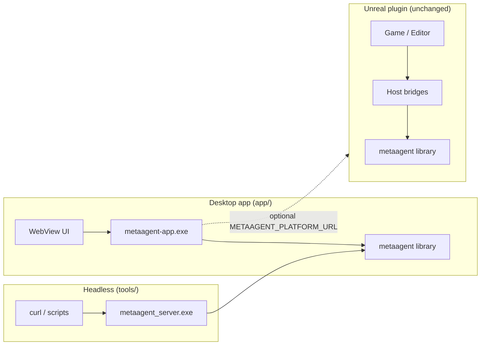

# metaagent

Portable C++17 core for the metaagent library. 

metaagent is a multimodal set of runtimes for media generation with humanoid design.

Applications include: **particle pattern mechanics**, **camera rig math**, **media/mask pipeline**, **HTTP (inbound + outbound)**, **session + command validation**, and **input policy**.

The **primary standalone host** is the desktop app in `[app/](./app/)` (WebView + embedded HTTP server). An Unreal Engine 5 plugin embeds the same library unchanged via `MetaAgentCoreAggregate.cpp`.

Full design notes: `[ARCHITECTURE.md](./ARCHITECTURE.md)`.

## Build

All commands from the repository root (`metaagent/`). Requires CMake 3.20+ and Git. Internet on first configure when building the app (FetchContent deps).

### Library only (no app)

Builds `metaagent` (static lib), all unit tests, and `metaagent_server` (headless CLI). **Default — app is off.**

**Windows / Linux** (same commands):

```sh
cmake -B build -DCMAKE_BUILD_TYPE=Release
cmake --build build -j
ctest --test-dir build --output-on-failure
```

### Library + app (usual workflow)

Also builds `**metaagent-app**` (WebView desktop host). Pass `-DMETAAGENT_BUILD_APP=ON`. Library, tests, and server are still built in the same tree.

**Windows** — VS 2022 **MSVC** x64, [WebView2 Runtime](https://developer.microsoft.com/microsoft-edge/webview2/)

```powershell
cmake -B build-msvc -G "Visual Studio 17 2022" -A x64 -DMETAAGENT_BUILD_APP=ON
cmake --build build-msvc --config Debug -j
.\build-msvc\app\Debug\metaagent-app.exe
```

Shortcut: `.\app\build_and_run.bat`

Release: use `--config Release` → `build-msvc\app\Release\metaagent-app.exe`

**Linux** — C++20, GTK 3, WebKit2GTK dev packages

```sh
cmake -B build -DMETAAGENT_BUILD_APP=ON -DCMAKE_BUILD_TYPE=Release
cmake --build build -j
./build/metaagent-app
```

Shortcut: `./app/build_and_run.sh`

App deps cache (Windows): `%LOCALAPPDATA%\metaagent-app-deps`

---

## MetaAgent desktop app (`app/`)

WebView + local HTTP server + control-panel UI. Serves embedded assets from `app/public/` and mounts the metaagent route table on the same port.

### Desktop app HTTP routes


| Method         | Route              | Description                                                       |
| -------------- | ------------------ | ----------------------------------------------------------------- |
| `GET`          | `/health`          | Liveness + session snapshot (portable handler)                    |
| `GET` / `POST` | `/echo`            | Echo query/body                                                   |
| `POST`         | `/notify`          | Ingest notify event; optional forward to UE via platform URL      |
| `POST`         | `/ai/chat`         | Ollama chat via `LanguageAiRuntime`                               |
| `GET`          | `/api/status`      | Host status: pattern FSM, particle count, toggles                 |
| `GET`          | `/api/config`      | Effective host configuration                                      |
| `GET`          | `/api/gui/catalog` | Portable GUI panel catalog                                        |
| `GET`          | `/api/notify/log`  | Recent notify messages                                            |
| `POST`         | `/api/command`     | Dispatch validated command (`{"command":"pattern_step_forward"}`) |


Static assets (`/`, `/style.css`, `/app.js`) are embedded in the executable.

### Environment variables


| Variable                            | Default                  | Purpose                                          |
| ----------------------------------- | ------------------------ | ------------------------------------------------ |
| `METAAGENT_NO_AI`                   | off                      | Set to `1` to disable `/ai/chat`                 |
| `METAAGENT_OLLAMA_URL`              | `http://127.0.0.1:11434` | Ollama base URL                                  |
| `METAAGENT_OLLAMA_MODEL`            | `llama3.2`               | Ollama model name                                |
| `METAAGENT_SYSTEM_PROMPT`           | built-in                 | System prompt for AI                             |
| `METAAGENT_PLATFORM_URL`            | empty                    | Forward `/notify` to UE or external orchestrator |
| `METAAGENT_PLATFORM_EVENT_ENDPOINT` | `/api/unreal/event`      | Path appended to platform URL                    |


Example — desktop app controlling a UE plugin instance that listens on port 8080:

```powershell
$env:METAAGENT_PLATFORM_URL = "http://127.0.0.1:8080"
.\build-msvc\app\Debug\metaagent-app.exe
```

## Headless HTTP server (`tools/`)

Minimal CLI without UI — useful for CI and scripting:

```sh
./build/metaagent_server.exe --port 8080
```

## Shared HTTP API (library handlers)

Both `metaagent-app` and `metaagent_server` expose these portable routes:


| Method         | Route      | Description                                            |
| -------------- | ---------- | ------------------------------------------------------ |
| `GET`          | `/health`  | Liveness + session snapshot (`status`, `map`, `build`) |
| `GET` / `POST` | `/echo`    | Echo back `msg` query param or raw POST body           |
| `POST`         | `/notify`  | Ingest a JSON/text event                               |
| `POST`         | `/ai/chat` | Send a prompt to Ollama; returns assistant text        |


### Examples

```sh
curl http://127.0.0.1:8080/health
curl "http://127.0.0.1:8080/echo?msg=hello"
curl -X POST http://127.0.0.1:8080/notify \
  -H "Content-Type: application/json" \
  -d '{"message":"start pattern"}'
curl -X POST http://127.0.0.1:8080/ai/chat \
  -H "Content-Type: application/json" \
  -d '{"prompt":"Hello"}'
```

Use `--no-ai` on `metaagent_server` to disable `/ai/chat`.




## What this library is

`metaagent` is the **domain layer** for a multimodal agent runtime. Hosts supply:

- **Desktop app** (`app/`): WebView, httplib server, mock particle I/O, command dispatch
- **Unreal plugin**: Niagara, viewport, Epic HTTPServer, async HTTP transport
- Type conversion (`FVector` ↔ `metaagent::core::Vec3`) and asset binding in UE only

Everything that can be expressed as **state + math + validation + JSON** lives here so it can be unit-tested without an editor.

## Layout

```
metaagent/
  metaagent.h                 Public umbrella API (single include)
  metaagent.cpp               Amalgamated implementation
  src/                        Portable domain modules
  app/                        Desktop host (WebView + HTTP + mock runtime)
    public/                   Embedded UI assets
    src/                      main, MetaAgentHost, HTTP mount
  tests/                      Standalone unit tests (CMake)
  tools/                      metaagent_server CLI + transport helpers
  CMakeLists.txt
  ARCHITECTURE.md
```

**UE embed rule:** compile only `metaagent.cpp` inside the plugin module. Never add `app/` or `tools/` sources to the Unreal build.

## Portable modules


| Namespace             | Responsibility                                                                                              |
| --------------------- | ----------------------------------------------------------------------------------------------------------- |
| `metaagent::particle` | FSM, scheduler, forming/return solvers, actuation compose, shape/mask, state effects, **visual continuity** |
| `metaagent::camera`   | Zoom, cinematic orbit pose, sway, `CameraController`                                                        |
| `metaagent::media`    | PNG/JPEG decode, mask pipeline, thumbnails                                                                  |
| `metaagent::net`      | Router, inbound handlers, `platform_client` (outbound)                                                      |
| `metaagent::session`  | `RuntimeSession`, feature flags, status text                                                                |
| `metaagent::app`      | Command parse/validate, GUI panel catalog, GUI action validation *(domain — not the desktop exe)*           |
| `metaagent::runtime`  | Host service callbacks + **ParticleHostCallbacks**                                                          |
| `metaagent::input`    | GUI-open vs observation-mode input policy                                                                   |
| `metaagent::ai`       | Ollama chat client, `LanguageAiRuntime`                                                                     |


## Host integration contract (particles)

The scheduler is **callback-driven**. Each host implements `SchedulerCallbacks` and `ParticleHostCallbacks`:


| Callback                                     | Desktop app (`app/`)           | UE plugin                         |
| -------------------------------------------- | ------------------------------ | --------------------------------- |
| `build_pattern_targets`                      | `ShapeBuilder` + mock baseline | Async mask cache, shape providers |
| `particle_host.read_displayed_positions`     | In-memory mock buffer          | Niagara displayed pose            |
| `particle_host.apply_world_positions`        | Write mock buffer              | Push to GPU/runtime               |
| `particle_host.authoritative_particle_count` | Mock grid count                | Live Niagara count                |


## HTTP


| Direction    | Core                         | Desktop app (`app/`) | UE host                    |
| ------------ | ---------------------------- | -------------------- | -------------------------- |
| **Inbound**  | `net/handlers`, `net/router` | httplib mount        | `FMetaAgentHttpBridge`     |
| **Outbound** | `net/platform_client`        | `sync_http_client`   | `FMetaAgentPlatformBridge` |


## Unreal integration (unchanged)

The UE plugin embeds this library via `Source/MetaAgentPlugin/MetaAgentCoreAggregate.cpp`.


| Adapter                            | Role                                                |
| ---------------------------------- | --------------------------------------------------- |
| `MetaAgentTypeBridge`              | UE ↔ core conversion, scheduler bridge, camera sync |
| `UMetaAgentParticleRuntime`        | Tick glue, Niagara actuation, displayed pose I/O    |
| `Host/MetaAgentHttpBridge`         | Inbound HTTPServer → `RouteTable`                   |
| `Host/MetaAgentPlatformBridge`     | Outbound platform POST                              |
| `Host/MetaAgentHostSession`        | Session snapshot for validation                     |
| `Host/MetaAgentInputBridge`        | Command / GUI dispatch                              |
| `Host/MetaAgentHostServicesBridge` | Recording + AI `HostServiceCallbacks`               |


The plugin does **not** compile `app/` or `tools/`. Both hosts link the same portable handlers in `src/net/`.

## Embed elsewhere

```cpp
#include "metaagent.h"

int main() {
    metaagent::initialize_defaults();
    // Use RouteTable, ParticleScheduler, platform_client, etc.
    return 0;
}
```

## Recommended next steps

1. Extend `/api/status` with richer session snapshot in core `/health`.
2. Headless FSM sweep tests with mock `ParticleHostCallbacks`.
3. Optional app icons under `app/icons/` (copied post-build on Windows).
4. Package script for portable Windows release (WebView2 + single exe).

Details: `[ARCHITECTURE.md](./ARCHITECTURE.md#roadmap)`.