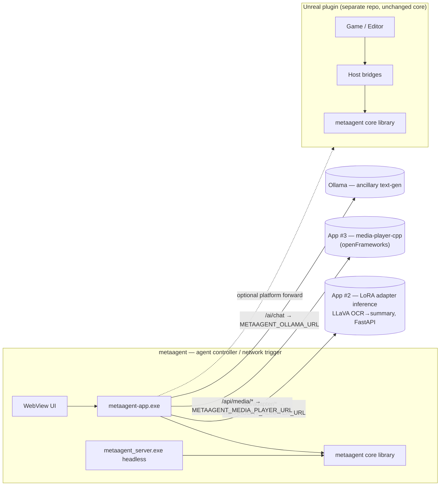

# metaagent

Portable C++17 core for the metaagent library — the **agent controller and
network trigger** of a three-application system.

metaagent is a multimodal set of runtimes for media generation with humanoid
design. It does not render or play media itself: it holds the domain logic
(particles, camera, masks, commands), and **coordinates two peer applications
over HTTP**.

| # | Application | Role | How metaagent reaches it |
| - | ----------- | ---- | ------------------------ |
| 1 | **metaagent** (this repo) | Agent controller + network trigger | — |
| 2 | **Adapter inference** (LoRA) | Trained **LLaVA 1.5 LoRA** adapter; OCR-text → summary generation. FastAPI service, [vecnode/pre-training](https://github.com/vecnode/pre-training) | Adapter seam: `/api/adapter/summarize` → `METAAGENT_ADAPTER_URL` (default `http://127.0.0.1:8008`) |
| 3 | **media-player-cpp** (openFrameworks) | Plays the media metaagent cues (clips, subtitles, focus crops) | Media proxy: `/api/media/*` → `METAAGENT_MEDIA_PLAYER_URL` (default `http://127.0.0.1:8080`) |

> **Two separate AI models, do not conflate them.** **Ollama** (`METAAGENT_OLLAMA_URL`,
> default `:11434`) is an ancillary, general **text-generation** endpoint used by
> the Dashboard *Text Assistant* — it is not one of the three apps. The **LoRA
> adapter** (app #2, `METAAGENT_ADAPTER_URL`, default `:8008`) is the purpose-trained
> LLaVA model used only for its own OCR→summary generation, surfaced as the
> separate *Document Adapter* panel.

Core capabilities: **particle pattern mechanics**, **camera rig math**,
**media/mask + corpus pipeline**, **HTTP (inbound + outbound)**, **signal/trigger
dispatch**, **session + command validation**, and **input policy**.

The **primary standalone host** is the desktop app in `[app/](./app/)` (WebView +
embedded HTTP server). A headless CLI lives in `[tools/](./tools/)`. An Unreal
Engine 5 plugin (separate repo) embeds the same library unchanged via
`MetaAgentCoreAggregate.cpp`.

Full design notes: `[ARCHITECTURE.md](./ARCHITECTURE.md)`. Working in the repo as
an agent: `[AGENTS.md](./AGENTS.md)`.

## Build

All commands from the repository root (`metaagent/`). Requires CMake 3.20+ and Git. Internet on first configure when building the app (FetchContent deps).

### Library + app (usual workflow)

Also builds `**metaagent-app**` (WebView desktop host). Pass `-DMETAAGENT_BUILD_APP=ON`. Library, tests, and server are still built in the same tree.

**Windows** — VS 2022 **MSVC** x64, [WebView2 Runtime](https://developer.microsoft.com/microsoft-edge/webview2/)

On first configure, FFmpeg is downloaded automatically into `third_party/ffmpeg/` when missing.

```powershell
cmake -B build-msvc -G "Visual Studio 17 2022" -A x64 -DMETAAGENT_BUILD_APP=ON
cmake --build build-msvc --config Debug -j
.\build-msvc\app\Debug\metaagent-app.exe
```

Optional FFmpeg overrides:

```powershell
# Disable auto-download and use an existing local FFmpeg prefix
cmake -B build-msvc -G "Visual Studio 17 2022" -A x64 -DMETAAGENT_BUILD_APP=ON -DMETAAGENT_FFMPEG_AUTO_DOWNLOAD=OFF -DMETAAGENT_FFMPEG_ROOT="C:/path/to/ffmpeg"

# Keep auto-download enabled but use a custom archive URL
cmake -B build-msvc -G "Visual Studio 17 2022" -A x64 -DMETAAGENT_BUILD_APP=ON -DMETAAGENT_FFMPEG_URL="https://.../ffmpeg-win64-shared.zip"

# Disable insecure TLS retry fallback (default is ON)
cmake -B build-msvc -G "Visual Studio 17 2022" -A x64 -DMETAAGENT_BUILD_APP=ON -DMETAAGENT_FFMPEG_ALLOW_INSECURE_DOWNLOAD=OFF
```

Shortcut: `.\app\build_and_run.bat`

Release: use `--config Release` → `build-msvc\app\Release\metaagent-app.exe`

**Linux** — C++20, GTK 3, WebKit2GTK dev packages

```sh
cmake -B build -DMETAAGENT_BUILD_APP=ON -DCMAKE_BUILD_TYPE=Release
cmake --build build -j
./build/metaagent-app
```

Shortcut: `./app/build_and_run.sh`

App deps cache (Windows): `%LOCALAPPDATA%\metaagent-app-deps`


### Library only

**Windows / Linux** (same commands):

```sh
cmake -B build -DCMAKE_BUILD_TYPE=Release
cmake --build build -j
ctest --test-dir build --output-on-failure
```


---

## MetaAgent desktop app (`app/`)

WebView + local HTTP server + control-panel UI. Serves embedded assets from `app/public/` and mounts the metaagent route table on the same port.

### Desktop app HTTP routes


| Method         | Route                       | Description                                                       |
| -------------- | --------------------------- | ----------------------------------------------------------------- |
| `GET`          | `/health`                   | Liveness + session snapshot (portable handler)                    |
| `GET` / `POST` | `/echo`                     | Echo query/body                                                   |
| `POST`         | `/notify`                   | Ingest notify event                                               |
| `POST`         | `/ai/chat`                  | Ollama text-gen chat via `LanguageAiRuntime`                      |
| `GET`          | `/api/status`               | Host status: pattern FSM, particle count, toggles                 |
| `GET`          | `/api/network/status`       | Peer connectivity: media player + adapter endpoint                |
| `GET`          | `/api/config`               | Effective host configuration                                      |
| `GET`          | `/api/gui/catalog`          | Portable GUI panel catalog                                        |
| `GET`          | `/api/runtimes`             | Runtime catalog (incl. optional UE5 runtimes)                     |
| `POST`         | `/api/runtimes/ue5`         | Enable/disable UE5 runtimes                                       |
| `GET`          | `/api/notify/log`           | Recent notify messages                                            |
| `GET`          | `/api/app/log`              | Recent host application log                                       |
| `POST`         | `/api/command`              | Dispatch validated command (`{"command":"pattern_step_forward"}`) |
| `GET`          | `/api/ollama/status`        | Ollama text-gen endpoint status + model list                      |
| `POST`         | `/api/ollama/config`        | Update Ollama model at runtime                                    |
| `GET`          | `/api/adapter/status`       | LoRA adapter liveness + device/mode/dtype                         |
| `POST`         | `/api/adapter/summarize`    | Proxy OCR text → adapter (`{"ocr_text":"…"}` → `{"summary":…}`)   |

**Media player coordination** (proxied to media-player-cpp, app #3):

| Method | Route                      | Proxies to              |
| ------ | -------------------------- | ----------------------- |
| `GET`  | `/api/media/status`        | `/api/status`           |
| `GET`  | `/api/media/clips`         | `/api/clips`            |
| `GET`  | `/api/media/log`           | host media-control log  |
| `POST` | `/api/media/play`          | `/api/play`             |
| `POST` | `/api/media/stop`          | `/api/stop`             |
| `POST` | `/api/media/next`          | `/api/next`             |
| `POST` | `/api/media/previous`      | `/api/previous`         |
| `POST` | `/api/media/subtitles`     | `/api/subtitles`        |
| `POST` | `/api/media/clips/{index}` | `/api/clips/{index}`    |

Static assets (`/`, `/style.css`, `/app.js`) are embedded in the executable.

### Environment variables


| Variable                     | Default                  | Purpose                                                   |
| ---------------------------- | ------------------------ | --------------------------------------------------------- |
| `METAAGENT_NO_AI`            | off                      | Set to `1` to disable `/ai/chat` (Ollama text-gen)        |
| `METAAGENT_OLLAMA_URL`       | `http://127.0.0.1:11434` | Ollama **text-gen** base URL (ancillary, not app #2)      |
| `METAAGENT_OLLAMA_MODEL`     | `llama3.2`               | Ollama text-gen model name                                |
| `METAAGENT_SYSTEM_PROMPT`    | built-in                 | System prompt for Ollama text-gen                         |
| `METAAGENT_ADAPTER_URL`      | `http://127.0.0.1:8008`  | **LoRA adapter** inference base URL (app #2)              |
| `METAAGENT_MEDIA_PLAYER_URL` | `http://127.0.0.1:8080`  | media-player-cpp base URL (app #3)                        |
| `METAAGENT_MEDIA_DATA_DIR`   | empty                    | Local media dataset dir (corpus + clip-mirror fallback)   |

All four URLs/model are also editable live from the app's **Settings → Endpoints**
table (`POST /api/config`), overriding the env var for the running session.

> Outbound forwarding to a UE/orchestrator host exists in core
> (`net/platform_client`, default event endpoint `/api/unreal/event`) but is not
> wired to an env var in the shipped hosts — wire it through a host if needed.

Example — point the LoRA adapter and media player at custom ports while keeping
Ollama text-gen on its default:

```powershell
$env:METAAGENT_ADAPTER_URL = "http://127.0.0.1:8008"
$env:METAAGENT_MEDIA_PLAYER_URL = "http://127.0.0.1:8090"
.\build-msvc\app\Debug\metaagent-app.exe
```

## Headless HTTP server (`tools/`)

Minimal CLI without UI — useful for CI and scripting. Configured by flags
(`--port`, default `30080`; `--ollama-url`; `--ollama-model`; `--no-ai`):

```sh
./build/metaagent_server.exe --port 30080 --ollama-url http://127.0.0.1:11434
```

## Shared HTTP API (library handlers)

Both `metaagent-app` and `metaagent_server` expose these portable routes:


| Method         | Route      | Description                                            |
| -------------- | ---------- | ------------------------------------------------------ |
| `GET`          | `/health`  | Liveness + session snapshot (`status`, `map`, `build`) |
| `GET` / `POST` | `/echo`    | Echo back `msg` query param or raw POST body           |
| `POST`         | `/notify`  | Ingest a JSON/text event                               |
| `POST`         | `/ai/chat` | Send a prompt to Ollama; returns assistant text        |


### Examples

```sh
curl http://127.0.0.1:8080/health
curl "http://127.0.0.1:8080/echo?msg=hello"
curl -X POST http://127.0.0.1:8080/notify \
  -H "Content-Type: application/json" \
  -d '{"message":"start pattern"}'
curl -X POST http://127.0.0.1:8080/ai/chat \
  -H "Content-Type: application/json" \
  -d '{"prompt":"Hello"}'
```

Use `--no-ai` on `metaagent_server` to disable `/ai/chat`.




## Portable modules


| Namespace             | Responsibility                                                                                              |
| --------------------- | ----------------------------------------------------------------------------------------------------------- |
| `metaagent::particle` | FSM, scheduler, forming/return solvers, actuation compose, shape/mask, state effects, **visual continuity** |
| `metaagent::camera`   | Zoom, cinematic orbit pose, sway, `CameraController`                                                        |
| `metaagent::media`    | PNG/JPEG decode, mask pipeline, thumbnails, **corpus** (PDF_TEXT/OBJS_TEXT → subtitles, focus crops)        |
| `metaagent::net`      | Router, inbound handlers, `platform_client` (outbound), **`signal_router`** (network triggers to peers)     |
| `metaagent::session`  | `RuntimeSession`, feature flags, status text                                                                |
| `metaagent::app`      | Command parse/validate, GUI panel catalog, GUI action validation *(domain — not the desktop exe)*           |
| `metaagent::runtime`  | Host service callbacks + **ParticleHostCallbacks**                                                          |
| `metaagent::input`    | GUI-open vs observation-mode input policy                                                                   |
| `metaagent::ai`       | Ollama chat client, `LanguageAiRuntime`                                                                     |


## Host integration contract (particles)

> **Particles run only in the Unreal Engine plugin.** The desktop app (`app/`)
> does **not** instantiate or tick a `ParticleScheduler` — there is no mock
> particle host. The `metaagent::particle` core remains in the library purely so
> the UE plugin can drive it.

The scheduler is **callback-driven**. The UE plugin implements `SchedulerCallbacks` and `ParticleHostCallbacks`:


| Callback                                     | UE plugin                         |
| -------------------------------------------- | --------------------------------- |
| `build_pattern_targets`                      | Async mask cache, shape providers |
| `particle_host.read_displayed_positions`     | Niagara displayed pose            |
| `particle_host.apply_world_positions`        | Push to GPU/runtime               |
| `particle_host.authoritative_particle_count` | Live Niagara count                |


## HTTP


| Direction    | Core                         | Desktop app (`app/`) | UE host                    |
| ------------ | ---------------------------- | -------------------- | -------------------------- |
| **Inbound**  | `net/handlers`, `net/router` | httplib mount        | `FMetaAgentHttpBridge`     |
| **Outbound** | `net/platform_client`        | `sync_http_client`   | `FMetaAgentPlatformBridge` |


## Unreal integration (unchanged)

The UE plugin embeds this library via `Source/MetaAgentPlugin/MetaAgentCoreAggregate.cpp`.


| Adapter                            | Role                                                |
| ---------------------------------- | --------------------------------------------------- |
| `MetaAgentTypeBridge`              | UE ↔ core conversion, scheduler bridge, camera sync |
| `UMetaAgentParticleRuntime`        | Tick glue, Niagara actuation, displayed pose I/O    |
| `Host/MetaAgentHttpBridge`         | Inbound HTTPServer → `RouteTable`                   |
| `Host/MetaAgentPlatformBridge`     | Outbound platform POST                              |
| `Host/MetaAgentHostSession`        | Session snapshot for validation                     |
| `Host/MetaAgentInputBridge`        | Command / GUI dispatch                              |
| `Host/MetaAgentHostServicesBridge` | Recording + AI `HostServiceCallbacks`               |


The plugin does **not** compile `app/` or `tools/`. Both hosts link the same portable handlers in `src/net/`.

## Embed elsewhere

```cpp
#include "metaagent.h"

int main() {
    metaagent::initialize_defaults();
    // Use RouteTable, ParticleScheduler, platform_client, etc.
    return 0;
}
```

Details: `[ARCHITECTURE.md](./ARCHITECTURE.md#roadmap)`.